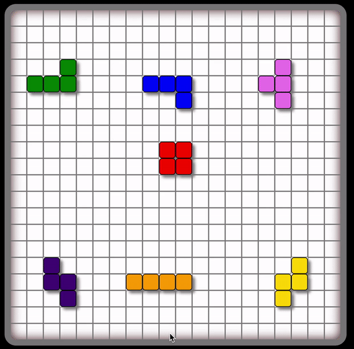

# Tetrix

This is a tetris Clone. In this version of Tetris the speed at which the blocks fall will increase as your level increases.

## [Play Online Now](https://ka9kdc.github.io/tetrix/)

### Deloyed at https://ka9kdc.github.io/tetrix/

## How to Play

Random Blocks will fall one at a time.

Falling Blocks can be rotated and moved left and right, so that they can fill in rows.

Fill a row to clear it.

You level up every time you clear 5 rows.

As you increase your level the blocks will start to fall faster.

Game will end when no more blocks can enter the board from the top of the board.

## Blocks

There are seven types of blocks falling down. In the shape of the letters: L, J, T, S, Z, I and O. All the blocks can be rotated and moved while falling, so you can control where they are placed.

## How to Score
| Action |Point Value|
| :---: | :---: |
|Clear a row| 100 points|
|Speed up descent| 1 point per row skipped |

## Controls

| Action | Keypress|
| :---: | :---: |
|Rotate Clockwise| A|
|Rotate Counter-Clockwise| S|
|Move Left| Left Arrow &#8592;|
|Move Right| Right Arrow &#8594;|
|Speed Up Descent| Down Arrow &#8595;|
|Slow Down Descent| Up Arrow &#8593;|

## Local Deployment

Clone down the repo `git clone <repoLink>`

There are no npm packages installed or used in this project currently. So, if you are using VS code, start your live server and navigate to the port the live server started. It is usually `http://127.0.0.1:5500/`. Otherwise add the code or packages needed to start a server in your prefered method.

## Meet the Engineer - Kelsey Schroeder

|                                           |  https://kelsey-schroeder.herokuapp.com     |
| :--------------------------------------------------------------------------------: | :----------------------------------------------------------------------------------------------------------------------------: |
|  https://github.com/Ka9kdc |  https://www.linkedin.com/in/kelsey-m-schroeder/ |
